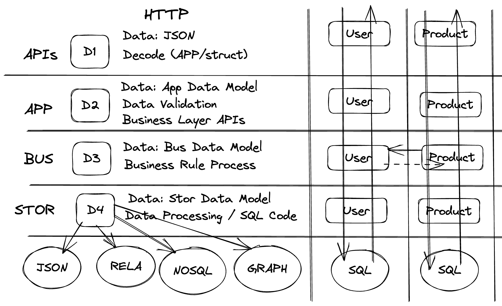

# go-firstcup

A starter Go project template with Docker Compose, Kibana log viewing, and `gonew` scaffolding support.

---

### 🏗️ Project Architecture



---

### 🚀 Installation

To clone the project:

```bash

git clone https://github.com/h2a26/go-firstcup.git
# or: git clone git@github.com:h2a26/go-firstcup.git
cd go-firstcup
go mod vendor
```
🧪 Create Your Own Version (Using gonew)

If you want to create your own project based on this template:

```bash

go install golang.org/x/tools/cmd/gonew@latest

gonew github.com/h2a26/go-firstcup github.com/mydomain/myproject
cd myproject
go mod vendor
```

▶️ Run Project

Start and stop the full stack using Docker Compose:
```bash

docker-compose --env-file .env -f zarf/compose/docker_compose.yaml up -d --build
```

```bash

docker-compose --env-file .env -f zarf/compose/docker_compose.yaml down -v
```

---

### 📊 Viewing Go Service Logs in Kibana

This project sends logs from the auth 🔐 and sales 💰 services to Elasticsearch.
Follow the steps below to view them in Kibana.

##### 1️⃣ Open Kibana

Go to:
👉 http://localhost:5601

##### 2️⃣ Create a Data View

Open the menu icon → Stack Management → Data Views

Click Create Data View

##### 3️⃣ Enter Index Name

Use the following index patterns:

* 🔐 Auth service logs: auth-*
* 💰 Sales service logs: sales-*

##### 4️⃣ Select Time Field

Choose `@timestamp` as the time filter field

Click Create Data View

##### 5️⃣ View Logs

Go to Discover 🔍 in the left menu

Select the Data View (`auth-*` or `sales-*`)

Adjust the time range in the top-right corner

##### 6️⃣ Optional Enhancements

Add useful fields: `msg`, `service`, `level`, `path`

Save searches for quick access

Build dashboards for monitoring

---